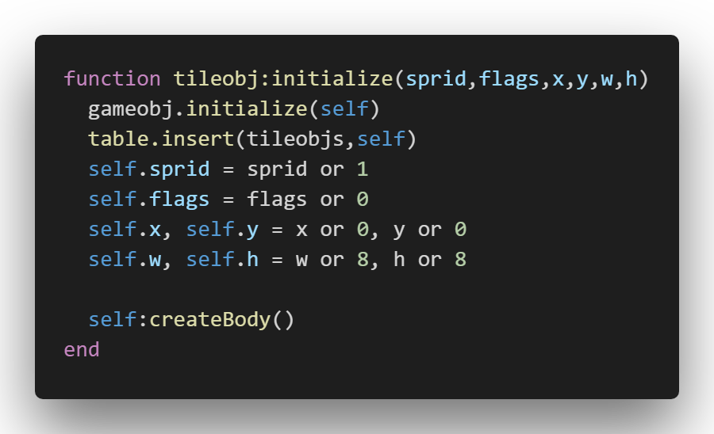

# LIKO-12 Language Extension

VS Code extension for the LIKO-12 cartridge format

## Features

This extension parses the LIKO-12 format by splitting it into four sections, and working with each one seperately.

- Lua Code: this section is treated as lua source code, using default syntax highlighting.

- Tilemap: this one is parsed as integers.
- Spritesheet: also this one is parsed as integers.
- Sfx: this section though, is treated as a special compound type.

> Tip: Many popular extensions utilize animations. This is an excellent way to show off your extension! We recommend short, focused animations that are easy to follow.

## Requirements

Currently there are no external dependancies.

## Extension Settings

Include if your extension adds any VS Code settings through the `contributes.configuration` extension point.

For example:

This extension contributes the following settings:

* `myExtension.enable`: enable/disable this extension
* `myExtension.thing`: set to `blah` to do something

## Known Issues

There are no currently known issues, but if you find any do not hesistate to add them to the tracker.

## Release Notes

Users appreciate release notes as you update your extension.

### 1.0.0

Initial release of this extension